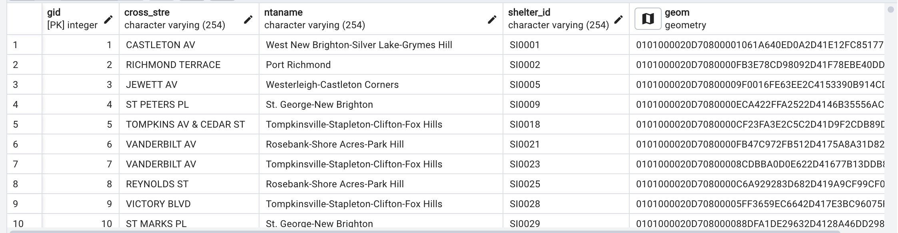
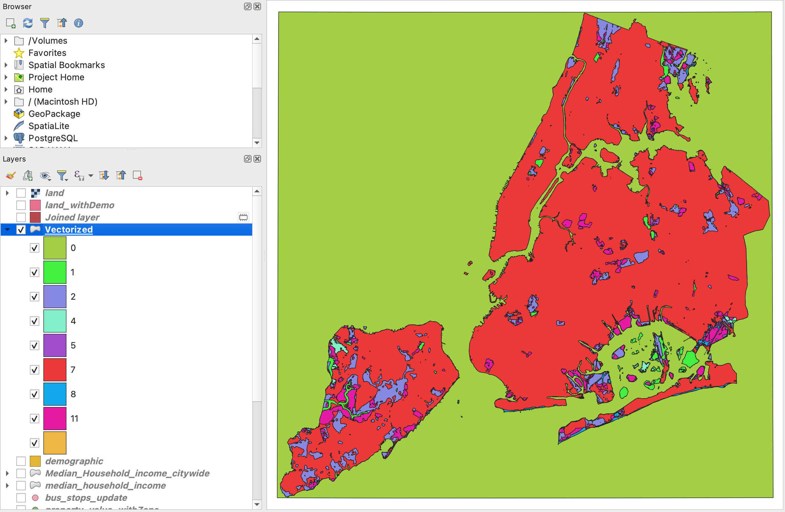

---

# TransEcon: Transportation and Economic Analysis in NYC

TransEcon is designed to investigate the influence of transportation infrastructure on economic development in New York City. This repository contains datasets and query to study the correlations between transportation access and various economic indicators.

## Project Objective

The aim of this project is to address key questions about the socioeconomic impacts of transportation infrastructure in NYC:

- How does transportation access influence economic growth, property values, and business activity in NYC?
- Are the economic benefits of transportation infrastructure equitably distributed across different demographic groups?


## Data

This project utilizes a variety of datasets sourced from public and governmental organizations. Below is a summary of the key datasets used:


| Name                   | Source                                      | Data Type   | Format             | Resolution | Link                                                                                                                          | Note                                         |
|------------------------|---------------------------------------------|-------------|--------------------|------------|-------------------------------------------------------------------------------------------------------------------------------|---------------------------------------------|
| New York Boundaries    | NYC Open Data                               | Vector      | Shapefile          | N/A        | [NYC Open Data - Borough Boundaries](https://data.cityofnewyork.us/City-Government/Borough-Boundaries/tqmj-j8zm)                                                                      | |
| Subway Lines           | Metropolitan Transportation Authority       | GTFS        | TXT                | N/A        | [MTA Developers](https://new.mta.info/developers)                                                                                         | Includes active subway routes and stops.        |
| Bus Stops             | Metropolitan Transportation Authority       | Vector        | Shapefile                | N/A        | [NYC Open Data](https://data.cityofnewyork.us/Transportation/Bus-Stop-Shelters/qafz-7myz)                                                                                         | Active bus stops.          |
| Airports               | NYC Open Data                               | Vector      | Shapefile          | N/A        | [NYC Open Data - AIRPORT_POLYGON](https://data.cityofnewyork.us/City-Government/AIRPORT_POLYGON/6dic-zdhf/about_data)          | Details of LaGuardia Airport and John F. Kennedy International Airport  |
| Land Use               | Esri Sentinel-2 Land Cover                  | Raster      | TIF                | 10 m       | [Sentinel-2 Land Cover](https://livingatlas.arcgis.com/landcoverexplorer/#mapCenter=-77.08371%2C26.38100%2C11&mode=step&timeExtent=2017%2C2023&year=2023) |           |
| Zoning                 | Department of Finance (DOF)                 | Vector      | Shapefile          | N/A        | [NYC Open Data - Zoning Data](https://data.cityofnewyork.us/City-Government/Zoning-GIS-Data-Shapefile/kdig-pewd)               |          |
| Property Values        | Department of Finance (DOF)                 | Vector      | MDB                | N/A        | [NYC Open Data - Property Valuation and Assessment Data](https://data.cityofnewyork.us/City-Government/Property-Valuation-and-Assessment-Data/yjxr-fw8i/about_data) |  |
| Demographic data            | United States Census Bureau                 | Vector      | Shapefile          | N/A        | [Census Bureau](https://www.census.gov/data/tables/2023/dec/2020-census-dhc.html)                                              |      |


## Data Processing

### Converting GTFS Data to Shapefiles in ArcGIS Pro

### **Step 1: Import GTFS Data**
- **Files:** Import `stops.txt` and `shapes.txt` from your GTFS dataset into ArcGIS Pro.

### **Step 2: Convert Stop Coordinates**
- **Tool:** Use **XY Table to Point**.
- **Input:** Select `stops.txt`.
- **Fields:** Assign longitude to **X Field** and latitude to **Y Field**.

### **Step 3: Create Route Shapefiles**
- **Tool:** Use **Points to Line**.
- **Input:** Use the point shapefile derived from `shapes.txt`.
- **Line Field:** Use `shape_id` to group points into lines.

### **Convert MDB to CSV on Mac**
1. **Conversion Tool**: Since Microsoft Access is not available on macOS, use a third-party tool.
   - (https://www.rebasedata.com/convert-mdb-to-csv-online)
2. **Export to CSV**: Choose CSV as the export format 

### **Convert CSV to Geospatial Data in ArcGIS Pro**
1. **Import CSV into ArcGIS Pro**:
   - “Add Data” and select  CSV file to import it into the project.
2. **Geocode CSV File**:
   - Navigate to the **Geocoding Tools** 
   - Select “Geocode Addresses” which is detailed on the [Geocode Addresses](https://pro.arcgis.com/en/pro-app/latest/tool-reference/geocoding/geocode-addresses.htm) page.
   - In the **Geocode Addresses** tool:
     - For the **Input Table**, select your imported CSV file.
     - Set the **Address Locator** to the address locator appropriate for the location data
     - Specify the fields in your CSV that correspond to the address components required by the address locator ( street, zip).

3. **Verify Geospatial Data**:
- 98% matched!


## Further processing
 - All data was reprojected to EPS:2263.

 - All data were clipped to New York City.

 - Layers to Consider Beyond NYC:
   - Airports: Major airports serving NYC (like John F. Kennedy International Airport and LaGuardia Airport) are not strictly within NYC’s geographic boundaries but have a significant impact on the city’s economy and transportation dynamics.

### Shapefile to SQL Commands

Converts shapefiles to SQL using `shp2pgsql` tool:

```bash
# Airports
shp2pgsql -I -s 2263 "/Users/binghui/Desktop/2024 SP/IDCE376 DATABASE/final/AIRPORT/airport.shp" public.airport > airport.sql

# Bus Stops
shp2pgsql -I -s 2263 "/Users/binghui/Desktop/2024 SP/IDCE376 DATABASE/final/bus/bus_stops.shp" public.bus_stops > bus_stops.sql

# NYC Boundary
shp2pgsql -I -s 2263 "/Users/binghui/Desktop/2024 SP/IDCE376 DATABASE/final/ny_boundary/ny_boundary.shp" public.ny_boundary > ny_boundary.sql

# Subway Routes
shp2pgsql -I -s 2263 "/Users/binghui/Desktop/2024 SP/IDCE376 DATABASE/final/subway/subway_route.shp" public.subway_route > subway_route.sql

# Subway Stops
shp2pgsql -I -s 2263 "/Users/binghui/Desktop/2024 SP/IDCE376 DATABASE/final/subway/subway_stops.shp" public.subway_stops > subway_stop.sql

# Zoning
shp2pgsql -I -s 2263 "/Users/binghui/Desktop/2024 SP/IDCE376 DATABASE/final/zoning/zoning.shp" public.zoning > zoning.sql

# Property Values
shp2pgsql -I -s 2263 "/Users/binghui/Desktop/2024 SP/IDCE376 DATABASE/final/propery_val/propery_val.shp" public.propery_val > propery_val.sql

# Demographic Census Tract 
shp2pgsql -I -s 2263 "/Users/binghui/Desktop/2024 SP/IDCE376 DATABASE/final/census_tract_update/census_tract.shp" public.census_tract > census_tract.sql
```

### Raster to SQL Commands

Converts raster data to SQL using `raster2pgsql` tool:

```bash
# Land Cover
raster2pgsql -s 2263 -I -C -M "/Users/binghui/Desktop/2024 SP/IDCE376 DATABASE/final/land cover/land.tif" public.land > land_cover.sql

```
   
## Data Normalization

-All datas are normalized and no need to edit; however, non-essential fields within the datasets were still need to be removed. 


### SQL  for Dropping Columns
```sql
ALTER TABLE [table_name]
  DROP COLUMN [column_name1],
  DROP COLUMN [column_name2],
  ...;
```

Using the above code for all the data to remove non-essential fields.


### Example of Cleaning the Bus Stops  Table

To simplify the dataset and focus on relevant fields, several non-essential columns were removed from the `bus stops` table. The following SQL command was executed to drop these columns:

```sql
ALTER TABLE bus_stops
  DROP COLUMN shape_id,
  DROP COLUMN sequence,
  DROP COLUMN stop_desc,
...;
```


### Initial bus stop table:


### Final bus stops table:



## Schema
### Schema for `bus_stops` Table
| Column Name  | 
|--------------|
| `gid`        | 
| `cross_stre` |
| `ntaname`    | 
| `shelter_id` | 
| `geom`       | 

### Schema for `airport` Table
| Column Name  | 
|--------------|
| `gid`        | 
| `name` 	   | 
| `geom`       | 


### Schema for `subway_route` Table
| Column Name  | 
|--------------|
| `gid`        | 
| `shape_leng` 	   | 
| `geom`       | 

### Schema for `subway_stops` Table
| Column Name  | 
|--------------|
| `gid`        | 
| `stop_id` 	   | 
| `stop_name`       | 
| `geom`       | 

### Schema for `property_value` Table
| Column Name  | 
|--------------|
| `gid`        | 
| `user_fullv` 	   | 
| `user_stadd`       | 
| `user_zip`       | 
| `geom`       | 

### Schema for `zoning` Table
| Column Name  | 
|--------------|
| `gid`        | 
| `zonedist` 	   | 
| `zone_gen`       | 
| `geom`       | 

### Schema for `ny_boundary` Table
| Column Name  | 
|--------------|
| `gid`        | 
| `boro_code` 	   | 
| `boro_name`       | 
| `shape_area`       | 
| `shape_leng`       | 
| `geom`       | 

### Schema for `demographic` Table
| Column Name  | 
|--------------|
| `gid`        | 
| `objectid` 	   | 
| `p012_calc_`       | 
| `p012_calc1`       | 
| `p012_cal_1`       | 
| `p012_cal_2`       | 
| `geom`       | 

### Schema for `land_cover` Table
| Column Name  | 
|--------------|
| `rid`        | 
| `rast` 	   | 

---
# Analysis
## 1. Transportation Access Influence

###  Overview
This SQL script calculates the influence of proximity to subway and bus stops on property values. It is divided into two parts, each targeting a different type of public transport. The results from both queries are combined using `UNION ALL`.


```sql
-- Calculating the influence of subway access
SELECT 
    AVG(property_value_withzone.user_fullv) AS avg_property_value_withzone, --Calculates the average of property value
    COUNT(*) AS num_properties, --Counts the total number of properties
    'Subway Access' AS transport_access_type
FROM 
    property_value_withzone 
JOIN 
    subway_stops ON ST_DWithin(property_value_withzone.geom, subway_stops.geom, 500) --ST_DWithin is used to ensure that only properties within 500 meters of a subway stop are included
GROUP BY 
    transport_access_type
UNION  ALL --this operator ensures that all results from both the subway and bus access queries are included in the final output, even if they are duplicates.

-- Calculating the influence of bus access
SELECT 
    AVG(property_value_withzone.user_fullv) AS avg_property_value_withzone,
    COUNT(*) AS num_properties,
    'Bus Access' AS transport_access_type
FROM 
    property_value_withzone
JOIN 
    bus_stops_update ON ST_DWithin(property_value_withzone.geom, bus_stops_update.geom, 500)
GROUP BY 
    transport_access_type
```
###   Results:
The following table summarizes the results of our analysis on the impact of proximity to public transportation (subway and bus stops) on property values. These results demonstrate the influence of transit access on property valuation within a 500-meter radius:
| Transport Access Type | Average Property Value | Number of Properties |
|-----------------------|------------------------|----------------------|
| Bus Access            | 1,544,947.31           | 277,266              |
| Subway Access         | 2,898,814.35           | 863,048              |


## Further analysis
###  Overview
Analyze the correlation between property values and their proximity to subway stops. 

```sql
--Calculates the average property value within different distance thresholds from subway stops:

SELECT 
    AVG(property_value_withzone.user_fullv) AS avg_property_value_withzone
FROM 
    property_value_withzone
JOIN 
    subway_stops ON ST_DWithin(property_value_withzone.geom, subway_stops.geom, <distance>)
WHERE property_value_withzone.user_fullv IS NOT NULL;
```

The `<distance>` placeholder is replaced with the specific distance thresholds (500m, 1000m, 1500m, and 2000m) to execute the query multiple times, each time analyzing a different  to subway stops.

###   Results:
The average property values at different distances from subway stops are reported as follows:

- **500 meters**: $2,898,814.35
- **1000 meters**: $2,585,224.54
- **1500 meters**: $2,387,841.68
- **2000 meters**: $2,325,656.41

These values represent the average property value within the respective distances from subway stops, indicating a trend where proximity appears to correlate with higher property value.


## 2. Analysis of Zoning Types within a 10 km Radius of Major NYC Airports
The  query provided examines various zoning areas located within a 10 km radius around New York City's major airports—LaGuardia Airport and John F. Kennedy International Airport.
This analysis is important for understanding how airport proximity might influence or correlate with different zoning designations such as residential areas, parks, commercial zones, and others.

```sql
SELECT 
    airport.gid,
    zoning.zone_gen,
    COUNT(zoning.zone_gen) AS zone_count --Counts the number of occurrences of each zoning type within the specified radius around each airport.

FROM 
    airport
JOIN 
    zoning ON ST_DWithin(airport.geom, zoning.geom, 10000) -- 10 km
GROUP BY 
    airport.gid, zoning.zone_gen
ORDER BY 
    airport.gid, zone_count DESC;
```

### Results

The results showcase the count of various zoning types within a 10 km radius of each airport:

- **LaGuardia Airport (gid 1)**:
  - Residential Zones (`R`): 173 occurrences
  - Parks (`PARK`): 67 occurrences
  - Manufacturing (`M`): 39 occurrences
  - Commercial (`C`): 30 occurrences
  - Playgrounds (`PLAYGROUND`): 5 occurrences

- **John F. Kennedy International Airport (gid 2)**:
  - Residential Zones (`R`): 161 occurrences
  - Parks (`PARK`): 57 occurrences
  - Commercial (`C`): 14 occurrences
  - Manufacturing (`M`): 11 occurrences
  - Playgrounds (`PLAYGROUND`): 4 occurrences


## Analysis of whether transportation infrastructure benefits are equitably distributed across different demographic groups

## 3. Analysis of Tree Canopy Coverage Relative to Income

### Overview

This analysis focuses on exploring the spatial distribution of tree canopy coverage and its correlation with income levels across various regions. 

### Environmental and Socio-Economic Implications
Tree canopies are vital urban infrastructure that not only beautify the environment but also provide crucial ecological and health benefits. Districts with fewer trees tend to experience higher temperatures, increased pollution, and greater susceptibility to flooding, which can lead to higher rates of heat-related illnesses and mortality. Trees play a critical role in removing pollutants from the air, cooling the urban environment, increasing soil permeability, mitigating flooding, and preventing stormwater runoff and street pollution from contaminating waterways.

According to studies conducted by the Leventhal Center for Advanced Urbanism (LCAU) at MIT, in New York City, neighborhoods with the least tree canopy coverage are often lower-income communities of color. This disparity highlights the need for targeted urban planning initiatives to address and rectify environmental injustices.


### Land Cover Classification

The raster data was classified into different types based on land cover, which was then converted to vector format for further analysis. Here is a summary of the land cover classes used:

| Value | Class Name       | Description                     |
|-------|------------------|---------------------------------|
| 1     | Water            | Areas covered by water bodies.  |
| 2     | Trees            | Regions predominantly covered by trees. |
| 4     | Flooded Vegetation | Areas with vegetation that are seasonally or permanently flooded. |
| 5     | Crops            | Agricultural areas used for crop production. |
| 7     | Built Area       | Urban areas with residential, commercial, and other built structures. |
| 8     | Bare Ground      | Land with little to no vegetation cover, typically bare soil or rocks. |
| 11    | Rangeland        | Land used for grazing livestock and other range activities. |
| 0     | Unspecified      | Areas not classified under any specific category. |

### Tools and Methods

For this project, I used the **Polygonise** tool to convert raster data into vector format. This conversion facilitates the spatial analysis of various land cover types and their correlation with socio-economic data.

Check it in QGIS: 

### Handling Geometric Data Errors
During the analysis, I encountered issues with self-intersections within the geometric data, which can lead to errors in spatial queries. These issues are manifested in notices such as:

```
NOTICE: Self-intersection at or near point 1024287.9524550693 181171.19658030535
```
### Integration of Land Cover with Socio-Economic Data
A spatial join was performed between the `land_withdemo` vector file, generated from the Polygonise tool, and the median household income data. This approach allowed us to correlate land cover data with income levels, addressing potential errors caused by problematic geometry in the original data. 

The `land_withdemo` table now includes these key columns:
- **suitable**: Identifies the type of land cover.
- **b19049_001**: Represents the median household income for the corresponding geographic area.


```sql
SELECT 
    b19049_001 AS median_income,
    COUNT(*) AS tree_canopy_count
FROM 
    land_withdemo
WHERE 
    suitable = '2' -- tree canopies
GROUP BY 
    b19049_001
ORDER BY 
    tree_canopy_count DESC;
```


### Results 
| median_income | tree_canopy_count        | 
|-------|------------------|
|99458.00000000000    |  52            | 
|  88558.00000000000     | 23            | 
| 141250.00000000000     | 19 | 
| 122321.00000000000 |    17 |
| 91509.00000000000 | 10 |
| ... | ... |


---
# 2. Analysis of  transportation infrastructure are equitably distributed

## Overview

To analyze whether the economic benefits of transportation infrastructure are equitably distributed across different demographic groups, compare access to transportation against various demographic indicators that might reflect economic benefits.


## SQL Query
```sql
SELECT 
    ct.gid AS census_tract_id,
    ct.p0010001 AS total_population,
    ct.p0120002 AS male_population,
    ct.p0120026 AS female_population,
    ct.p012_calc_ AS population_under_18,
    ct.p012_calc1 AS population_65_and_over,
    ct.p012_cal_1 AS population_18_to_64,
    AVG(pv.user_fullv) AS avg_property_value,
    COUNT(DISTINCT ss.stop_id) AS num_subway_stops,
    COUNT(DISTINCT bs.stop_id) AS num_bus_stops
FROM 
    census_tract ct
LEFT JOIN 
    propery_val pv ON ST_Contains(ct.geom, pv.geom)
LEFT JOIN 
    subway_stops ss ON ST_DWithin(ct.geom, ss.geom, 500)
LEFT JOIN 
    bus_stops bs ON ST_DWithin(ct.geom, bs.geom, 500)
GROUP BY 
    ct.gid, ct.p0010001, ct.p0120002, ct.p0120026, ct.p012_calc_, ct.p012_calc1, ct.p012_cal_1;
```


## Results
| census_tract_id | total_population | male_population | female_population | population_under_18 | population_65_and_over | population_18_to_64 | avg_property_value | num_subway_stops | num_bus_stops |
|-----------------|------------------|-----------------|-------------------|---------------------|------------------------|---------------------|--------------------|------------------|---------------|
| 1               | 2163             | 1030            | 1133              | 425                 | 237                    | 773                 | 458561.28          | 0                | 0             |
| 2               | 1395             | 712             | 683               | 321                 | 237                    | 558                 | 1054500.00         | 2                | 0             |
| ...             | ...              | ...             | ...               | ...                 | ...                    | ...                 | ...                | ...              | ...           |


# 3. Does the development of transportation infrastructure correlate with changes in employment rates in surrounding areas?

## Overview

Use the presence and density of commercial properties within census tracts as a proxy for employment rates. Assumes that areas with a higher density of commercial properties likely have higher employment rates.

Analyze demographic distributions in relation to transportation access, potentially identifying if certain groups (like working-age individuals or seniors) are more likely to live in areas with better public transportation.


## SQL Query
```sql
SELECT 
    ct.gid AS census_tract_id,
    ct.p0010001 AS total_population,  -- Total population in the census tract
    -- Assuming these column names are for the specific age demographics
    ct.p012_calc_ AS population_under_18,  
    ct.p012_calc1 AS population_65_and_over,  
    ct.p012_cal_1 AS population_18_to_64,
    AVG(pv.user_fullv) AS avg_property_value,  -- Average property value in the census tract
    COUNT(DISTINCT ss.stop_id) AS num_subway_stops,  -- Number of subway stops within 500 meters
    COUNT(DISTINCT bs.stop_id) AS num_bus_stops  -- Number of bus stops within 500 meters
FROM 
    census_tract ct
LEFT JOIN 
    propery_val pv ON ST_Contains(ct.geom, pv.geom)
LEFT JOIN 
    zoning z ON ST_Contains(z.geom, pv.geom) AND z.zone_gen LIKE 'C%'
LEFT JOIN 
    subway_stops ss ON ST_DWithin(ct.geom, ss.geom, 500)
LEFT JOIN 
    bus_stops bs ON ST_DWithin(ct.geom, bs.geom, 500)
GROUP BY 
    ct.gid, ct.p0010001, ct.p012_calc_, ct.p012_calc1, ct.p012_cal_1
ORDER BY 
    avg_property_value DESC, num_subway_stops DESC, num_bus_stops DESC;

```


## Results
| census_tract_id | total_population | population_under_18 | population_65_and_over | population_18_to_64 | avg_property_value | num_subway_stops | num_bus_stops |
|-----------------|------------------|---------------------|------------------------|---------------------|--------------------|------------------|---------------|
| 1698            | 2214             | 138                 | 37                     | 175                 | NULL               | 10               | 0             |
| 2315            | 8645             | 561                 | 98                     | 659                 | NULL               | 10               | 0             |
| 1975            | 1434             | 180                 | 65                     | 245                 | NULL               | 10               | 0             |
| 2200            | 4399             | 248                 | 78                     | 326                 | NULL               | 8                | 0             |
| 2297            | 4932             | 1011                | 372                    | 1383                | NULL               | 8                | 0             |
| 1359            | 4260             | 559                 | 333                    | 892                 | NULL               | 8                | 0             |
| ...             | ...              | ...                 | ...                    | ...                 | ...                | ...              | ...           |
