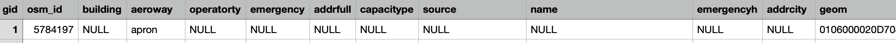
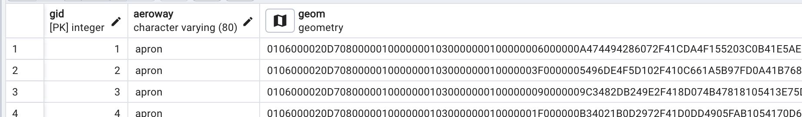
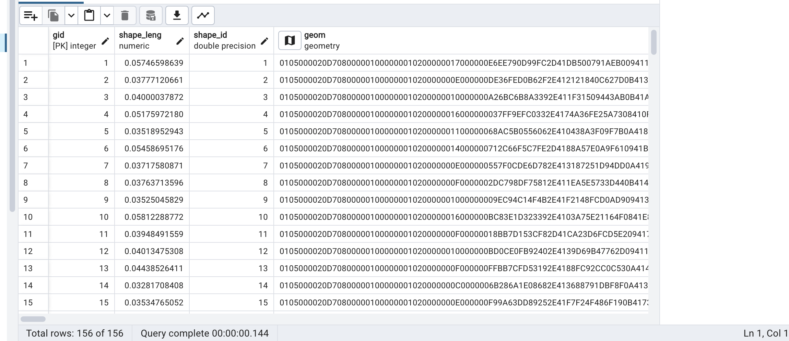
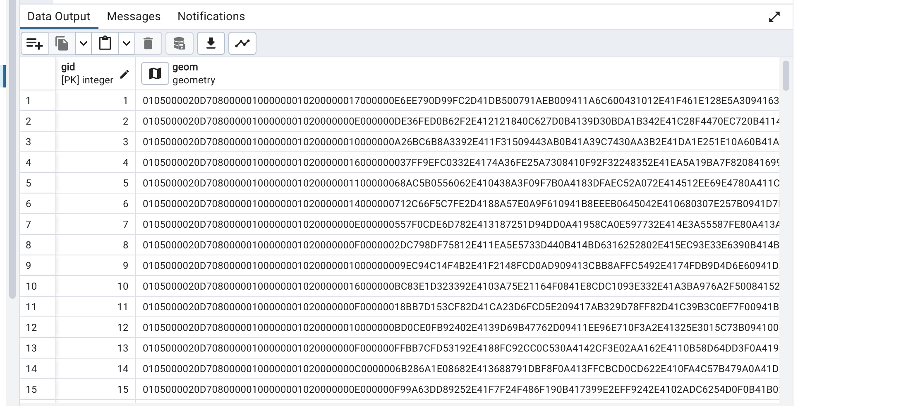
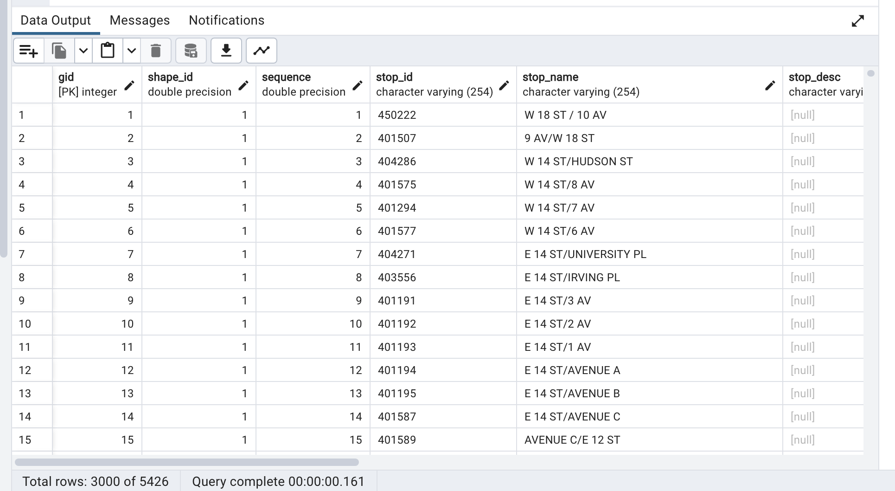
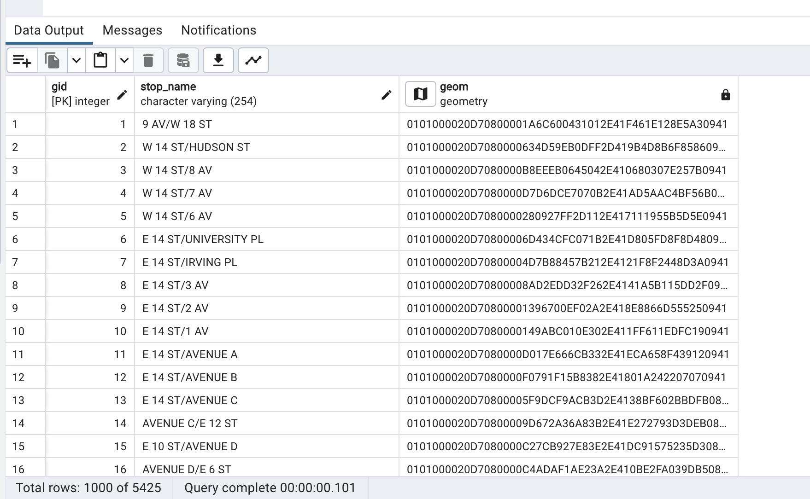
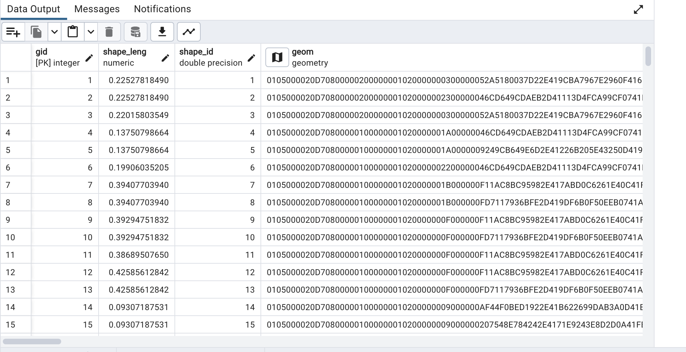
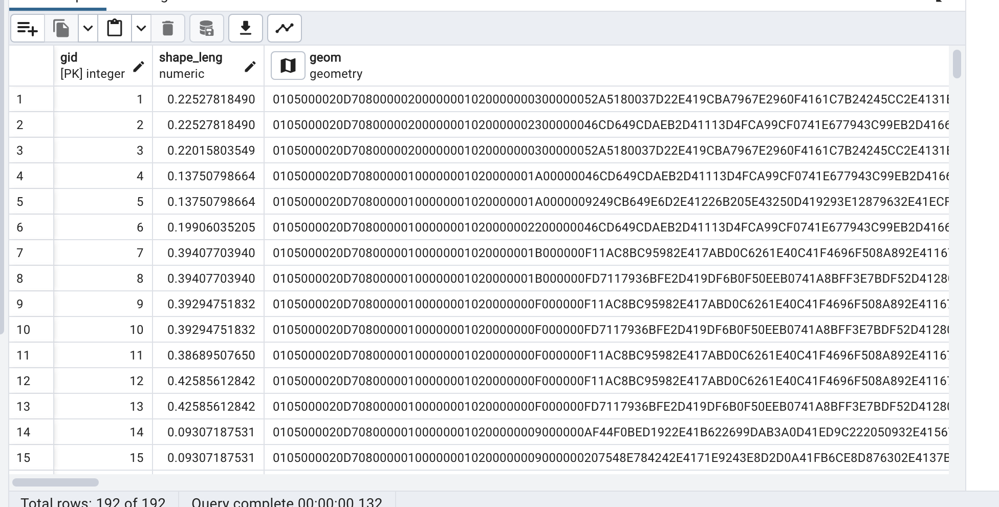
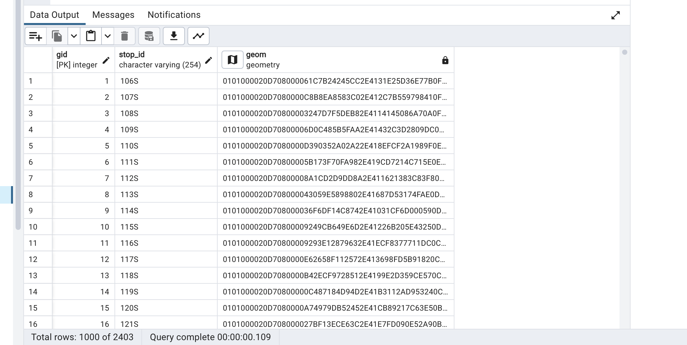

---

# TransEcon: Transportation and Economic Analysis in NYC

TransEcon is designed to investigate the influence of transportation infrastructure on economic development in New York City. This repository contains datasets and query to study the correlations between transportation access and various economic indicators.

## Project Objective

The aim of this project is to address key questions about the socioeconomic impacts of transportation infrastructure in NYC:

- How does transportation access influence economic growth, property values, and business activity in NYC?
- Are the economic benefits of transportation infrastructure equitably distributed across different demographic groups?


## Data

This project utilizes a variety of datasets sourced from public and governmental organizations. Below is a summary of the key datasets used:

| Name                   | Source                                      | Data Type | Format           | Resolution     | Link                                                                     |
|------------------------|---------------------------------------------|-----------|------------------|----------------|--------------------------------------------------------------------------|
| New York Boundaries    | NYC Open Data                               | Vector    | Shapefile        | N/A            | [NYC Open Data - Borough Boundaries](https://example.com)                |
| Subway Lines           | Metropolitan Transportation Authority       | GTFS      | TXT              | N/A            | [MTA Developers](https://example.com)                                   |
| Bus Routes             | Metropolitan Transportation Authority       | GTFS      | TXT              | N/A            | [MTA Developers](https://example.com)                                   |
| Airports               | NYC Open Data                               | Vector    | Shapefile        | N/A            | [NYC Open Data - AIRPORT_POLYGON](https://data.cityofnewyork.us/City-Government/AIRPORT_POLYGON/6dic-zdhf/about_data)   |
| Land Use               | Esri Sentinel-2 Land Cover  | Raster    | TIF              | 10 m| [Sentinel-2 Land Cover](https://livingatlas.arcgis.com/landcoverexplorer/#mapCenter=-77.08371%2C26.38100%2C11&mode=step&timeExtent=2017%2C2023&year=2023)           |
| Zoning        | Department of Finance (DOF)                 | File Database Format | Shapefile  | N/A            | [NYC Open Data - Zoning  Data](https://data.cityofnewyork.us/City-Government/Zoning-GIS-Data-Shapefile/kdig-pewd) |
| Property Values        | Department of Finance (DOF)                 | File Database Format | MDB  | N/A            | [NYC Open Data - Property Valuation and Assessment Data](https://data.cityofnewyork.us/City-Government/Property-Valuation-and-Assessment-Data/yjxr-fw8i/about_data) |
| Demographic            | United States Census Bureau                 | Vector   | Shapefile        | N/A            | [Census Bureau](https://www.census.gov/data/tables/2023/dec/2020-census-dhc.html)       |

## Data Processing

### Converting GTFS Data to Shapefiles in ArcGIS Pro

### **Step 1: Import GTFS Data**
- **Files:** Import `stops.txt` and `shapes.txt` from your GTFS dataset into ArcGIS Pro.

### **Step 2: Convert Stop Coordinates**
- **Tool:** Use **XY Table to Point**.
- **Input:** Select `stops.txt`.
- **Fields:** Assign longitude to **X Field** and latitude to **Y Field**.

### **Step 3: Create Route Shapefiles**
- **Tool:** Use **Points to Line**.
- **Input:** Use the point shapefile derived from `shapes.txt`.
- **Line Field:** Use `shape_id` to group points into lines.

### **Convert MDB to CSV on Mac**
1. **Conversion Tool**: Since Microsoft Access is not available on macOS, use a third-party tool.
   - (https://www.rebasedata.com/convert-mdb-to-csv-online)
2. **Export to CSV**: Choose CSV as the export format 

### **Convert CSV to Geospatial Data in ArcGIS Pro**
1. **Import CSV into ArcGIS Pro**:
   - “Add Data” and select  CSV file to import it into the project.
2. **Geocode CSV File**:
   - Navigate to the **Geocoding Tools** 
   - Select “Geocode Addresses” which is detailed on the [Geocode Addresses](https://pro.arcgis.com/en/pro-app/latest/tool-reference/geocoding/geocode-addresses.htm) page.
   - In the **Geocode Addresses** tool:
     - For the **Input Table**, select your imported CSV file.
     - Set the **Address Locator** to the address locator appropriate for the location data
     - Specify the fields in your CSV that correspond to the address components required by the address locator ( street, zip).

3. **Verify Geospatial Data**:
- 98% matched!


## Further processing
 - All data was reprojected to EPS:2263

 - Data 'Subway Route',  'Subway Stops', 'Land Use',  'Property Values ',  'Demographic', 'DEM'  were clipped to New York City
 
 - Clip 'Bus Routes' and 'Bus Stops' to Manhattan
   - Manhattan has some of the highest traffic densities in New York City, and by concentrating on just this borough, I can more effectively analyze and explore the relationship with economics.
   

 - Layers to Consider Beyond NYC:
   - Airports: Major airports serving NYC (like JFK, LaGuardia, and Newark Liberty International Airport) are not strictly within NYC’s geographic boundaries but have a significant impact on the city’s economy and transportation dynamics

### Shapefile to SQL Commands

Converts shapefiles to SQL using `shp2pgsql` tool:

```bash
# Airports
shp2pgsql -I -s 2263 "/Users/binghui/Desktop/2024 SP/IDCE376 DATABASE/final/AIRPORT/airport.shp" public.airport > airport.sql

# Bus Routes
shp2pgsql -I -s 2263 "/Users/binghui/Desktop/2024 SP/IDCE376 DATABASE/final/bus/bus_route.shp" public.bus_route > bus_route.sql

# Bus Stops
shp2pgsql -I -s 2263 "/Users/binghui/Desktop/2024 SP/IDCE376 DATABASE/final/bus/bus_stops.shp" public.bus_stops > bus_stops.sql

# NYC Boundary
shp2pgsql -I -s 2263 "/Users/binghui/Desktop/2024 SP/IDCE376 DATABASE/final/ny_boundary/ny_boundary.shp" public.ny_boundary > ny_boundary.sql

# Subway Routes
shp2pgsql -I -s 2263 "/Users/binghui/Desktop/2024 SP/IDCE376 DATABASE/final/subway/subway_route.shp" public.subway_route > subway_route.sql

# Subway Stops
shp2pgsql -I -s 2263 "/Users/binghui/Desktop/2024 SP/IDCE376 DATABASE/final/subway/subway_stops.shp" public.subway_stops > subway_stop.sql

# Zoning
shp2pgsql -I -s 2263 "/Users/binghui/Desktop/2024 SP/IDCE376 DATABASE/final/zoning/zoning.shp" public.zoning > zoning.sql

# Property Values
shp2pgsql -I -s 2263 "/Users/binghui/Desktop/2024 SP/IDCE376 DATABASE/final/propery_val/propery_val.shp" public.propery_val > propery_val.sql

# Demographic Census Tract 
shp2pgsql -I -s 2263 "/Users/binghui/Desktop/2024 SP/IDCE376 DATABASE/final/census_tract_update/census_tract.shp" public.census_tract > census_tract.sql
```

### Raster to SQL Commands

Converts raster data to SQL using `raster2pgsql` tool:

```bash
# Land Cover
raster2pgsql -s 2263 -I -C -M "/Users/binghui/Desktop/2024 SP/IDCE376 DATABASE/final/land cover/land.tif" public.land > land_cover.sql

# DEM 
raster2pgsql -s 2263 -I -C -M "/Users/binghui/Desktop/2024 SP/IDCE376 DATABASE/final/dem_update/dem_update.tif" public.dem_update > dem_update.sql
```
   
## Data Normalization

### Airport
- Imported into database, non-essential fields were dropped using the following queries in pgAdmin :

```
ALTER TABLE airport
  DROP COLUMN operatorty,
  DROP COLUMN emergency,
  DROP COLUMN addrfull,
  DROP COLUMN capacitype,
  DROP COLUMN addrcity,
  DROP COLUMN osm_id,
  DROP COLUMN source,
  DROP COLUMN building,
  DROP COLUMN emergencyh;
```

### Initial airport table:


### Final airport table:



### Bus route

- Imported into database, non-essential fields were dropped using the following queries in pgAdmin :
```
ALTER TABLE bus_route

  DROP COLUMN shape_leng,
  DROP COLUMN shape_id;
```

### Initial bus route table:



### Final bus route table:


### Bus stops
- Imported into database, non-essential fields were dropped using the following queries in pgAdmin :

```
ALTER TABLE bus_stops
  DROP COLUMN shape_id,
  DROP COLUMN sequence,
  DROP COLUMN stop_id,
-- Include all other columns
```

### Initial bus stop table:


### Final bus stops table:


### Subway route
- Imported into database, non-essential fields were dropped using the following queries in pgAdmin :
```
ALTER TABLE subway_route

  DROP COLUMN shape_id,
-- Include all other columns
```

### Initial Subway route table:


### Final Subway route table:


### Subway stops (same steps above )

### Final Subway stops table:



--
# Analysis
## 1. Influence of Transportation Access on Property Values
The SQL query is designed to determine the influence of transportation access on property values by comparing the average property values within a 500-meter radius of subway and bus stops. 

### SQL Query

The first part calculates the average property value and the total number of properties within 500 meters of subway stops, while the second part does the same for bus stops. 

```sql
-- Subway access influence
SELECT 
    AVG(p.user_fullv) AS avg_property_value,
    COUNT(*) AS num_properties,
    'Subway Access' AS transport_access_type
FROM 
    propery_val p
JOIN 
    subway_stops s ON ST_DWithin(p.geom, s.geom, 500)
GROUP BY 
    transport_access_type
UNION ALL
-- Bus access influence
SELECT 
    AVG(p.user_fullv) AS avg_property_value,
    COUNT(*) AS num_properties,
    'Bus Access' AS transport_access_type
FROM 
    propery_val p
JOIN 
    bus_stops b ON ST_DWithin(p.geom, b.geom, 500)
GROUP BY 
    transport_access_type;
```

### Query Results
- **Subway Access**:
  - Average Property Value: $2,898,814.35
  - Number of Properties: 863,048

- **Bus Access**:
  - Average Property Value: $2,511,570.85
  - Number of Properties: 1,205,611

### Analysis

The query results suggest that properties within close proximity to subway stops have a higher average value compared to those near bus stops. 


# Analysis of Property Values to Subway Stops

## Overview

Analyze the correlation between property values and their proximity to subway stops. 
## SQL Query

Calculates the average property value within different distance thresholds from subway stops:

```sql
SELECT AVG(p.user_fullv) AS average_property_value
FROM propery_val p
JOIN subway_stops s ON ST_DWithin(p.geom, s.geom, <distance>)
WHERE p.user_fullv IS NOT NULL;
```

The `<distance>` placeholder is replaced with the specific distance thresholds (500m, 1000m, 1500m, and 2000m) to execute the query multiple times, each time analyzing a different  to subway stops.

## Results

The average property values at different distances from subway stops are reported as follows:

- **500 meters**: $2,898,814.35
- **1000 meters**: $2,585,224.54
- **1500 meters**: $2,387,841.68
- **2000 meters**: $2,325,656.41

These values represent the average property value within the respective distances from subway stops, indicating a trend where proximity appears to correlate with higher property value.


## Analysis 

The analysis suggests a pattern where average property values tend to be higher closer to subway stops. 


# 2. Analysis of  transportation infrastructure are equitably distributed

## Overview

To analyze whether the economic benefits of transportation infrastructure are equitably distributed across different demographic groups, compare access to transportation against various demographic indicators that might reflect economic benefits.


## SQL Query
```sql
SELECT 
    ct.gid AS census_tract_id,
    ct.p0010001 AS total_population,
    ct.p0120002 AS male_population,
    ct.p0120026 AS female_population,
    ct.p012_calc_ AS population_under_18,
    ct.p012_calc1 AS population_65_and_over,
    ct.p012_cal_1 AS population_18_to_64,
    AVG(pv.user_fullv) AS avg_property_value,
    COUNT(DISTINCT ss.stop_id) AS num_subway_stops,
    COUNT(DISTINCT bs.stop_id) AS num_bus_stops
FROM 
    census_tract ct
LEFT JOIN 
    propery_val pv ON ST_Contains(ct.geom, pv.geom)
LEFT JOIN 
    subway_stops ss ON ST_DWithin(ct.geom, ss.geom, 500)
LEFT JOIN 
    bus_stops bs ON ST_DWithin(ct.geom, bs.geom, 500)
GROUP BY 
    ct.gid, ct.p0010001, ct.p0120002, ct.p0120026, ct.p012_calc_, ct.p012_calc1, ct.p012_cal_1;
```


## Results
| census_tract_id | total_population | male_population | female_population | population_under_18 | population_65_and_over | population_18_to_64 | avg_property_value | num_subway_stops | num_bus_stops |
|-----------------|------------------|-----------------|-------------------|---------------------|------------------------|---------------------|--------------------|------------------|---------------|
| 1               | 2163             | 1030            | 1133              | 425                 | 237                    | 773                 | 458561.28          | 0                | 0             |
| 2               | 1395             | 712             | 683               | 321                 | 237                    | 558                 | 1054500.00         | 2                | 0             |
| ...             | ...              | ...             | ...               | ...                 | ...                    | ...                 | ...                | ...              | ...           |


# 3. Does the development of transportation infrastructure correlate with changes in employment rates in surrounding areas?

## Overview

Use the presence and density of commercial properties within census tracts as a proxy for employment rates. Assumes that areas with a higher density of commercial properties likely have higher employment rates.

Analyze demographic distributions in relation to transportation access, potentially identifying if certain groups (like working-age individuals or seniors) are more likely to live in areas with better public transportation.


## SQL Query
```sql
SELECT 
    ct.gid AS census_tract_id,
    ct.p0010001 AS total_population,  -- Total population in the census tract
    -- Assuming these column names are for the specific age demographics
    ct.p012_calc_ AS population_under_18,  
    ct.p012_calc1 AS population_65_and_over,  
    ct.p012_cal_1 AS population_18_to_64,
    AVG(pv.user_fullv) AS avg_property_value,  -- Average property value in the census tract
    COUNT(DISTINCT ss.stop_id) AS num_subway_stops,  -- Number of subway stops within 500 meters
    COUNT(DISTINCT bs.stop_id) AS num_bus_stops  -- Number of bus stops within 500 meters
FROM 
    census_tract ct
LEFT JOIN 
    propery_val pv ON ST_Contains(ct.geom, pv.geom)
LEFT JOIN 
    zoning z ON ST_Contains(z.geom, pv.geom) AND z.zone_gen LIKE 'C%'
LEFT JOIN 
    subway_stops ss ON ST_DWithin(ct.geom, ss.geom, 500)
LEFT JOIN 
    bus_stops bs ON ST_DWithin(ct.geom, bs.geom, 500)
GROUP BY 
    ct.gid, ct.p0010001, ct.p012_calc_, ct.p012_calc1, ct.p012_cal_1
ORDER BY 
    avg_property_value DESC, num_subway_stops DESC, num_bus_stops DESC;

```


## Results
| census_tract_id | total_population | population_under_18 | population_65_and_over | population_18_to_64 | avg_property_value | num_subway_stops | num_bus_stops |
|-----------------|------------------|---------------------|------------------------|---------------------|--------------------|------------------|---------------|
| 1698            | 2214             | 138                 | 37                     | 175                 | NULL               | 10               | 0             |
| 2315            | 8645             | 561                 | 98                     | 659                 | NULL               | 10               | 0             |
| 1975            | 1434             | 180                 | 65                     | 245                 | NULL               | 10               | 0             |
| 2200            | 4399             | 248                 | 78                     | 326                 | NULL               | 8                | 0             |
| 2297            | 4932             | 1011                | 372                    | 1383                | NULL               | 8                | 0             |
| 1359            | 4260             | 559                 | 333                    | 892                 | NULL               | 8                | 0             |
| ...             | ...              | ...                 | ...                    | ...                 | ...                | ...              | ...           |
