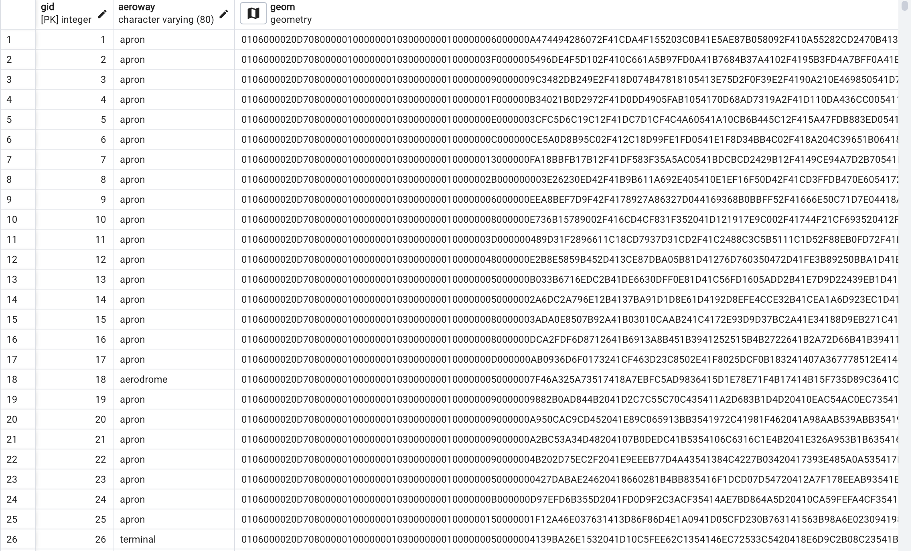

---

# TransEcon: Transportation and Economic Analysis in NYC

TransEcon is designed to investigate the influence of transportation infrastructure on economic development in New York City. This repository contains datasets and query to study the correlations between transportation access and various economic indicators.

## Project Objective

The aim of this project is to address key questions about the socioeconomic impacts of transportation infrastructure in NYC:

- How does transportation access influence economic growth, property values, and business activity in NYC?
- Are the economic benefits of transportation infrastructure equitably distributed across different demographic groups?
- Does the development of transportation infrastructure correlate with changes in employment rates in surrounding areas?

## Data

This project utilizes a variety of datasets sourced from public and governmental organizations. Below is a summary of the key datasets used:

| Name                   | Source                                      | Data Type | Format           | Resolution     | Link                                                                     |
|------------------------|---------------------------------------------|-----------|------------------|----------------|--------------------------------------------------------------------------|
| New York Boundaries    | NYC Open Data                               | Vector    | Shapefile        | N/A            | [NYC Open Data - Borough Boundaries](https://example.com)                |
| Subway Lines           | Metropolitan Transportation Authority       | GTFS      | TXT              | N/A            | [MTA Developers](https://example.com)                                   |
| Bus Routes             | Metropolitan Transportation Authority       | GTFS      | TXT              | N/A            | [MTA Developers](https://example.com)                                   |
| Airports               | NYC Open Data                               | Vector    | Shapefile        | N/A            | [NYC Open Data - AIRPORT_POLYGON](https://data.cityofnewyork.us/City-Government/AIRPORT_POLYGON/6dic-zdhf/about_data)   |
| DEM                    | New York State GIS Resource                 | Raster    | TIF              |  1 arc-second        | [USGS](https://apps.nationalmap.gov/downloader/)                            |
| Land Use               | Esri Sentinel-2 Land Cover  | Raster    | TIF              | 10 m| [Sentinel-2 Land Cover](https://livingatlas.arcgis.com/landcoverexplorer/#mapCenter=-77.08371%2C26.38100%2C11&mode=step&timeExtent=2017%2C2023&year=2023)           |
| Zoning        | Department of Finance (DOF)                 | File Database Format | Shapefile  | N/A            | [NYC Open Data - Zoning  Data](https://data.cityofnewyork.us/City-Government/Zoning-GIS-Data-Shapefile/kdig-pewd) |
| Property Values        | Department of Finance (DOF)                 | File Database Format | MDB  | N/A            | [NYC Open Data - Property Valuation and Assessment Data](https://data.cityofnewyork.us/City-Government/Property-Valuation-and-Assessment-Data/yjxr-fw8i/about_data) |

## Data Processing

### Converting GTFS Data to Shapefiles in ArcGIS Pro

### **Step 1: Import GTFS Data**
- **Files:** Import `stops.txt` and `shapes.txt` from your GTFS dataset into ArcGIS Pro.

### **Step 2: Convert Stop Coordinates**
- **Tool:** Use **XY Table to Point**.
- **Input:** Select `stops.txt`.
- **Fields:** Assign longitude to **X Field** and latitude to **Y Field**.

### **Step 3: Create Route Shapefiles**
- **Tool:** Use **Points to Line**.
- **Input:** Use the point shapefile derived from `shapes.txt`.
- **Line Field:** Use `shape_id` to group points into lines.

### **Convert MDB to CSV on Mac**
1. **Conversion Tool**: Since Microsoft Access is not available on macOS, use a third-party tool.
   - (https://www.rebasedata.com/convert-mdb-to-csv-online)
2. **Export to CSV**: Choose CSV as the export format 

### **Convert CSV to Geospatial Data in ArcGIS Pro**
1. **Import CSV into ArcGIS Pro**:
   - “Add Data” and select  CSV file to import it into the project.
2. **Geocode CSV File**:
   - Navigate to the **Geocoding Tools** 
   - Select “Geocode Addresses” which is detailed on the [Geocode Addresses](https://pro.arcgis.com/en/pro-app/latest/tool-reference/geocoding/geocode-addresses.htm) page.
   - In the **Geocode Addresses** tool:
     - For the **Input Table**, select your imported CSV file.
     - Set the **Address Locator** to the address locator appropriate for the location data
     - Specify the fields in your CSV that correspond to the address components required by the address locator ( street, zip).

3. **Verify Geospatial Data**:
- 98% matched!


## General Data Processing

- All spatial data was reprojected to EPS:2263
  
- Convert GTFS data:first import the GTFS stops.txt and shapes.txt files into ArcGIS. Convert stop coordinates to point shapefiles and transform route coordinates from shapes.txt into line shapefiles, using tools "XY Table to Point" and "Points to Line", respectively.
- Data was clipped to New York City


## Data Normalization

### Airport
- Imported into database, non-essential fields were dropped using the following queries in pgAdmin :

```
ALTER TABLE airport
  DROP COLUMN operatorty,
  DROP COLUMN emergency,
  DROP COLUMN addrfull,
  DROP COLUMN capacitype,
  DROP COLUMN addrcity,
  DROP COLUMN osm_id,
  DROP COLUMN source,
  DROP COLUMN building,
  DROP COLUMN emergencyh;
```

### Initial airport table:


### Final airport table:


### Road
- Imported into database, non-essential fields were dropped using the following queries in pgAdmin :
  
```
ALTER TABLE ny_road
  DROP COLUMN datemodifi,
  DROP COLUMN nysstreeti,
-- Include all other columns
```

### Final road table:



### Bus route

- Imported into database, non-essential fields were dropped using the following queries in pgAdmin :
```
ALTER TABLE bus_route

  DROP COLUMN shape_leng,
  DROP COLUMN shape_id;
```

### Initial bus route table:


### Final bus route table:


### Bus stops
- Imported into database, non-essential fields were dropped using the following queries in pgAdmin :

```
ALTER TABLE bus_stops
  DROP COLUMN shape_id,
  DROP COLUMN sequence,
  DROP COLUMN stop_id,
-- Include all other columns
```

### Initial bus stop table:


### Final bus stops table:


### Subway route
- Imported into database, non-essential fields were dropped using the following queries in pgAdmin :
```
ALTER TABLE subway_route

  DROP COLUMN shape_id,
-- Include all other columns
```

### Initial Subway route table:


### Final Subway route table:


### Subway stops (same steps above )

### Final Subway stops table:

